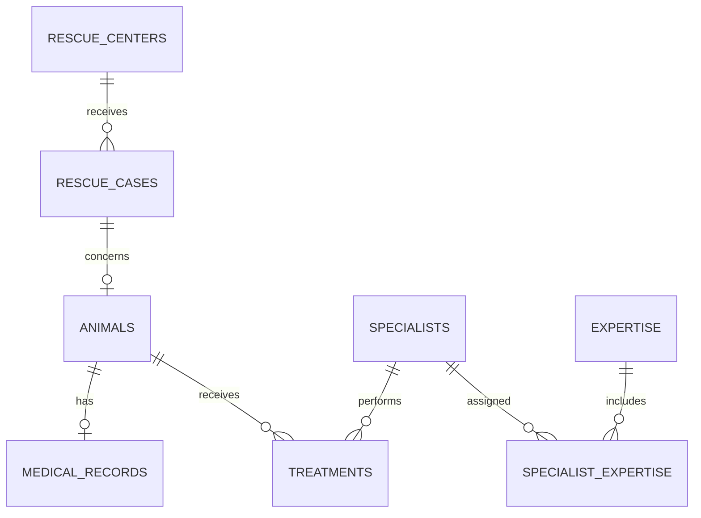

# DeepBlue Rescue

## 1. Descripción

DeepBlue Rescue es una aplicación Java con Spring Boot para gestionar centros de rescate, casos de rescate, animales, historias médicas, especialistas, áreas de experiencia y tratamientos. Usa Spring Data JPA para el acceso a datos, PostgreSQL como base de datos, Flyway para las migraciones y MapStruct para convertir entidades en DTO.

## 2. Modelo de datos

La base de datos contiene estas tablas:

| Tabla | Propósito |
| --- | --- |
| `rescue_centers` | Centros de rescate, identificados por código, nombre y ciudad. |
| `rescue_cases` | Casos de rescate, con código, fecha, ubicación, estado y centro asociado. |
| `animals` | Animales y sus datos de identificación, sexo y dispositivo de seguimiento. |
| `medical_records` | Registro médico inicial del animal, peso, condición, lesiones y observaciones. |
| `specialists` | Especialistas, código profesional, nombre, correo y estado activo. |
| `expertise` | Catálogo de áreas de experiencia. |
| `specialist_expertise` | Tabla de unión entre especialistas y áreas de experiencia. |
| `treatments` | Tratamientos realizados a un animal por un especialista. |

Los identificadores primarios son `BIGINT` autogenerados. Los códigos de centro, caso, especialista y animal tienen restricciones `UNIQUE` donde se definen en las migraciones. También hay restricciones de clave foránea, índices y restricciones `CHECK` para los estados del caso, el sexo del animal y el tipo de tratamiento.

## 3. Relaciones



- Un centro puede registrar varios casos; cada caso pertenece a un centro.
- Un caso puede tener como máximo un animal asociado. `animals.rescue_case_id` es único y puede ser nulo.
- Un animal puede tener como máximo un registro médico; cada registro médico pertenece a un animal.
- Un animal puede tener varios tratamientos; cada tratamiento pertenece a un animal y a un especialista.
- Especialistas y áreas de experiencia tienen una relación muchos a muchos mediante `specialist_expertise`.

## 4. Requisitos

- JDK 21.
- Para ejecutar la aplicación, una instancia PostgreSQL accesible.
- Docker Desktop en ejecución para ejecutar las pruebas de integración con Testcontainers.
- Maven Wrapper incluido en el repositorio (`mvnw.cmd` en Windows, `./mvnw` en Linux/macOS). No es necesario instalar Maven por separado.

## 5. Configuración y ejecución

La configuración predeterminada está en `src/main/resources/application.yaml`:

| Variable | Valor predeterminado |
| --- | --- |
| `DB_URL` | `jdbc:postgresql://localhost:5432/deepblue` |
| `DB_USER` | `postgres` |
| `DB_PASSWORD` | `postgres` |

Crea la base de datos `deepblue` en PostgreSQL, o define esas variables de entorno para usar otra conexión. Flyway aplicará las migraciones al iniciar la aplicación; Hibernate valida el esquema con `ddl-auto: validate`.

Desde la carpeta del proyecto, en Windows CMD:

```cmd
mvnw.cmd spring-boot:run
```

En Linux/macOS:

```bash
./mvnw spring-boot:run
```

## 6. Ejecución de tests

Ejecutar todos los tests en Windows:

```cmd
mvnw.cmd clean test
```

En Linux/macOS:

```bash
./mvnw clean test
```

Las pruebas unitarias de servicios usan JUnit, AssertJ y Mockito; se pueden ejecutar sin Docker. Por ejemplo, en Windows:

```cmd
mvnw.cmd -Dtest=RescueCaseServiceImplTest,TreatmentServiceImplTest,AnimalServiceImplTest test
```

`PersistenceIntegrationTest` usa PostgreSQL mediante Testcontainers, así que necesita Docker Desktop iniciado. La suite comprueba migraciones, persistencia, relaciones, consultas y restricciones de base de datos. La prueba unitaria de `TreatmentServiceImpl` cubre el registro válido y rechaza los casos indicados por las reglas de negocio sin guardar el tratamiento.

## 7. Flyway

Flyway administra el esquema mediante migraciones SQL versionadas en `src/main/resources/db/migration`. El esquema lo crean las migraciones; Hibernate solo lo valida y no lo genera (`ddl-auto: validate`). Flyway registra las versiones ejecutadas en `flyway_schema_history`.

Migraciones actuales:

| Migración | Cambio |
| --- | --- |
| `V1__create_schema.sql` | Crea las tablas principales, claves, índices y `CHECK` de estados de rescate. |
| `V2__insert_expertise_catalog.sql` | Inserta las áreas de experiencia iniciales. |
| `V3__add_tracking_device_to_animal.sql` | Añade el código único del dispositivo de seguimiento del animal. |
| `V4__add_animal_sex_and_treatment_type_checks.sql` | Añade restricciones `CHECK` para sexo y tipo de tratamiento. |

Las migraciones ya ejecutadas deben conservarse sin cambios; los cambios posteriores al esquema se agregan en una nueva versión.

## 8. Testcontainers

Testcontainers inicia un PostgreSQL temporal para `PersistenceIntegrationTest`. La prueba usa la imagen `postgres:18-alpine`, y Spring Boot obtiene de ese contenedor la conexión de base de datos para el contexto de prueba. Al finalizar, el contenedor se elimina. Esto permite probar Flyway y PostgreSQL reales sin configurar una base de datos local para la suite de integración.

Docker Desktop debe estar iniciado antes de ejecutar todos los tests. Las pruebas unitarias Mockito no requieren contenedor.

## 9. Query Methods

Consultas derivadas por Spring Data JPA en los repositorios:

| Repositorio | Query Method | Función |
| --- | --- | --- |
| `RescueCenterRepository` | `findByCode(String code)` | Busca un centro por código. |
| `RescueCaseRepository` | `findByCaseCode(String caseCode)` | Busca un caso por código. |
| `RescueCaseRepository` | `findByStatus(RescueStatus status)` | Busca casos por estado. |
| `RescueCaseRepository` | `findByStatusOrderByRescueDateAsc(RescueStatus status)` | Busca por estado y ordena por fecha ascendente. |
| `RescueCaseRepository` | `findByRescueCenterCode(String centerCode)` | Busca casos por código del centro relacionado. |
| `RescueCaseRepository` | `findByRescueDateAfterOrderByRescueDateDesc(LocalDate date)` | Busca casos posteriores a una fecha, en orden descendente. |
| `AnimalRepository` | `findByAnimalCode(String animalCode)` | Busca un animal por código. |
| `AnimalRepository` | `findByCommonNameContainingIgnoreCase(String commonName)` | Busca por nombre común sin distinguir mayúsculas. |
| `AnimalRepository` | `findByRescueCaseStatus(RescueStatus status)` | Busca animales por estado de su caso. |
| `AnimalRepository` | `findByRescueCaseRescueCenterCode(String centerCode)` | Busca animales por código del centro de su caso. |
| `ExpertiseRepository` | `findByNameIgnoreCase(String name)` | Busca un área de experiencia sin distinguir mayúsculas. |
| `SpecialistRepository` | `findByProfessionalCode(String professionalCode)` | Busca un especialista por código profesional. |
| `TreatmentRepository` | `findByAnimalAnimalCodeOrderByPerformedAtAsc(String animalCode)` | Busca tratamientos por código del animal, ordenados cronológicamente. |
| `TreatmentRepository` | `findByAnimalIdOrderByPerformedAtAsc(Long animalId)` | Busca tratamientos por ID del animal, ordenados cronológicamente. |

## 10. Consultas JPQL

Consultas declaradas con `@Query`:

1. **`SpecialistRepository.findActiveByExpertise(expertiseName)`**: selecciona especialistas activos que tienen el área indicada. Compara el nombre del área sin distinguir mayúsculas y ordena el resultado por nombre.
2. **`TreatmentRepository.findByPerformedAtBetween(start, end)`**: selecciona tratamientos cuya fecha está dentro del intervalo, inclusive, y los ordena cronológicamente.
3. **`TreatmentRepository.findByRescueCenterCode(centerCode)`**: navega desde tratamiento a animal, caso y centro para buscar por código del centro.
4. **`TreatmentRepository.findBySpecialistExpertise(expertiseName)`**: selecciona tratamientos cuyo especialista está asociado al área indicada, comparando el nombre sin distinguir mayúsculas.

Estas consultas usan nombres de entidades y propiedades Java, no nombres de tablas o columnas SQL.
